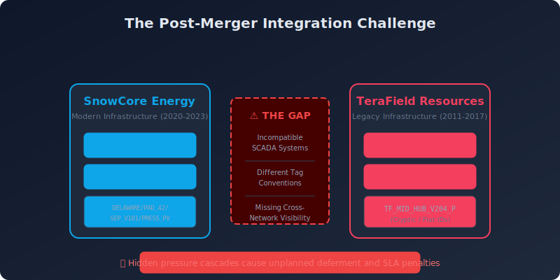
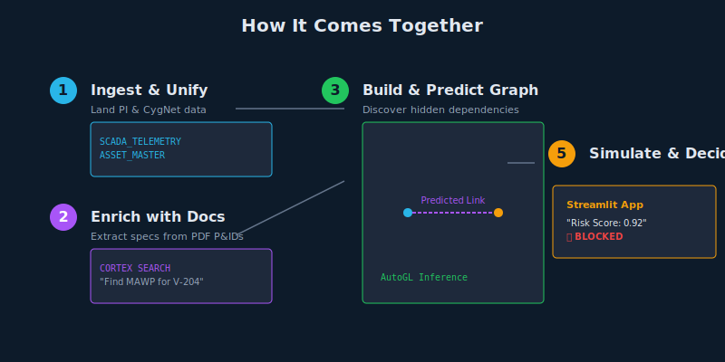
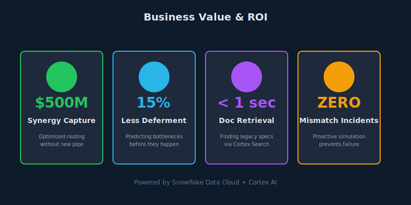
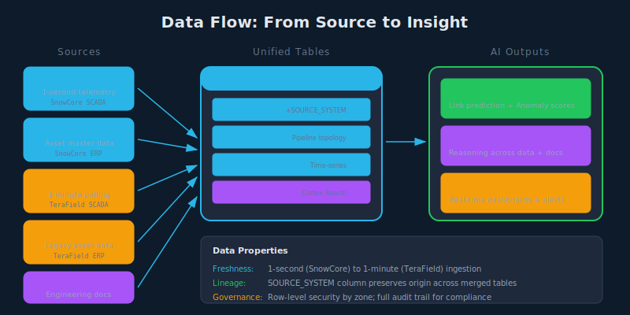
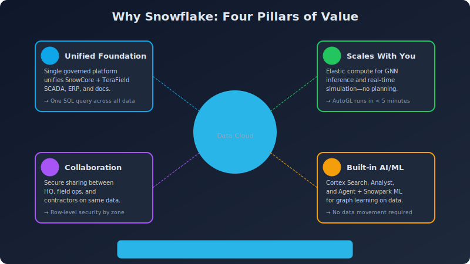
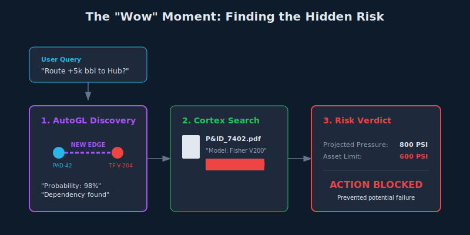
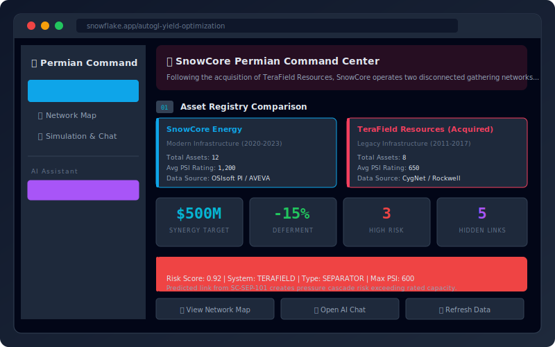

# Graph-Powered Post-Merger Integration for Energy: Achieve Unified Operations with Snowflake

Midstream operators lose millions annually when acquired assets operate as blind spots.

---

## The Cost of Inaction



**Texas Winter Storm Uri (February 2021)**: $195B in damages and catastrophic grid failure caused by frozen equipment and lack of system-wide visibility. For post-merger operators, the inability to see across legacy and acquired networks creates similar risks—where pressure mismatches and hidden bottlenecks trigger unplanned flaring, deferment, and safety incidents.

---

## The Problem in Context

- **Data fragmentation blocks synergy capture.** Two SCADA historians (OSIsoft PI vs. CygNet), two ERPs, and conflicting tags mean operators cannot query the combined network.
- **Equipment mismatches create hidden risk.** SnowCore's 1,500 PSI separators feed into TeraField's 500 PSI legacy pipes; without visibility, pressure cascades are inevitable.
- **Tribal knowledge is locked in documents.** Valve specs exist only in PDF P&IDs and decade-old maintenance logs that engineers cannot search during a crisis.
- **Reactive operations erode margins.** Controllers discover bottlenecks only after alarms sound, causing production deferment and SLA penalties.

---

## The Transformation



We move from **reactive firefighting**—where engineers manually hunt for PDFs and controllers guess at routing capacities—to **proactive optimization**. By unifying telemetry and documents in a graph model, operators can simulate flow changes and detect risks *before* they touch a valve.

---

## What We'll Achieve

- **Capture acquisition synergies.** Optimize flow routing without new pipe investment.
- **Reduce unplanned deferment.** 15% reduction by predicting cross-network pressure bottlenecks.
- **Accelerate decision-making.** Sub-second document retrieval for legacy equipment specs.
- **Prevent equipment failures.** Zero pressure-mismatch incidents via proactive simulation.

---

## Business Value



- **$500M** estimated value via optimized flow routing and synergy capture.
- **15%** reduction in unplanned deferment events.
- **Zero** safety incidents from pressure mismatches.
- **<1 sec** to retrieve legacy asset specifications vs. hours of manual search.

---

## Why Snowflake

- **Unified data foundation.** A single governed platform unifies SCADA, ERP, and documents so operators query the entire network with one SQL statement.
- **Performance that scales.** Elastic compute runs graph neural network inference and real-time simulations without capacity planning friction.
- **Collaboration without compromise.** Secure data sharing enables headquarters and field operations to work from the same trusted data.
- **Built-in AI/ML and apps.** Cortex AI and Snowpark ML enable graph learning and intelligent reasoning directly on data—no movement required.

---

## The Data



### Source Tables

| Table | Type | Records | Purpose |
|-------|------|---------|---------|
| `ASSET_MASTER` | Dimension | ~5k | Equipment attributes from SAP/Maximo (Nodes) |
| `NETWORK_EDGES` | Fact | ~10k | Pipeline connections and topology (Edges) |
| `SCADA_TELEMETRY` | Fact | ~1B+ | High-frequency sensor time-series (PI/CygNet) |
| `MAINTENANCE_LOGS` | Unstructured | ~50k | PDF/Text documents containing legacy specs |

### Data Characteristics

- **Freshness:** Telemetry ingested at 1-second (SnowCore) and 1-minute (TeraField) intervals via Snowpipe Streaming.
- **Trust:** `SOURCE_SYSTEM` column preserves lineage; row-level security restricts view by field zone.
- **Relationships:** Graph topology constructed dynamically from asset and edge tables.

---

## Solution Architecture



- **Ingest:** Snowpipe and Dynamic Tables unify disparate SCADA feeds.
- **Enrich:** Cortex Search extracts specs from PDF P&IDs.
- **Model:** Snowpark ML (AutoGL) predicts missing links in the network graph.
- **Serve:** Streamlit in Snowflake provides simulation and AI chat interfaces.

---

## How It Comes Together

1. **Ingest & Unify.** Land SnowCore (PI) and TeraField (CygNet) telemetry into common schema. → [See `02_tables.sql`](../sql/02_tables.sql)
2. **Enrich with Documents.** Parse P&IDs and extract specs using Cortex Search. → [See `03_cortex_search.sql`](../sql/03_cortex_search.sql)
3. **Build the Graph.** Construct network topology from asset master and GIS data. → [See `autogl_link_prediction.ipynb`](../notebooks/autogl_link_prediction.ipynb)
4. **Predict Hidden Links.** Run AutoGL to discover undocumented dependencies. → [See `autogl_link_prediction.ipynb`](../notebooks/autogl_link_prediction.ipynb)
5. **Score Risk & Simulate.** Cortex Agent flags assets where predicted pressure exceeds ratings. → [See `05_cortex_agent.sql`](../sql/05_cortex_agent.sql)

---

## Key Visualizations

### Risk Discovery: The "Wow" Moment



When an operator asks *"Can I route 5,000 extra barrels through Midland Hub?"*, the system runs AutoGL inference to find hidden links (e.g., to legacy valve TF-V-204), checks Cortex Search for the valve's pressure rating (600 PSI), and blocks the action if projected pressure (800 PSI) is too high.

### Permian Command Center Dashboard



The application provides:
- **Network Map:** Interactive geospatial view of SnowCore (Blue) and TeraField (Red) assets.
- **Simulation Controls:** Sliders to test production increases and routing changes.
- **AI Chat:** Natural language interface to query asset specs and risk status.

---

## Call to Action

**Primary: Run the Demo in Your Account**

```bash
# 1. Clone and generate data
git clone https://github.com/snowflake-labs/autogl-yield-optimization
cd autogl-yield-optimization
python3 utils/generate_synthetic_data.py

# 2. Deploy to Snowflake
./deploy.sh

# 3. Launch App
# Open Snowsight → Streamlit → AUTOGL_YIELD_OPTIMIZATION_APP
```

**Secondary: Adapt for Your Network**

- **Review the data model** in `sql/02_tables.sql` to map your SCADA export.
- **Customize graph features** in `notebooks/autogl_link_prediction.ipynb` for your topology.
- **Book a working session** with the Snowflake Energy team to pilot this architecture.

---

*SnowCore Permian Command Center — Powered by Snowflake Cortex AI + AutoGL Graph Neural Networks*
